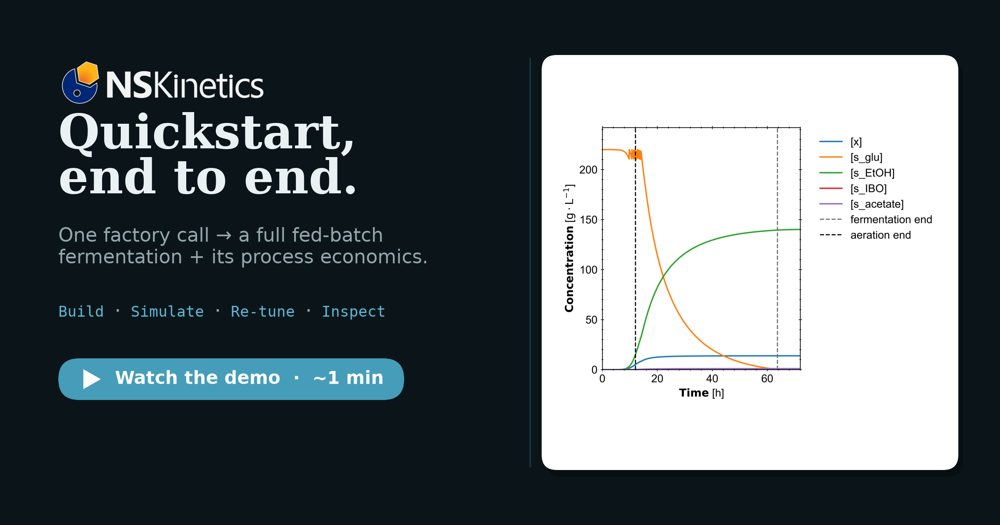

.. image:: docs/source/_static/images/logo/logo_nskinetics_light_white-circle.png
  :width: 250

===============================================================
The (Non-)Steady state Kinetics simulation package (NSKinetics)
===============================================================

.. image:: http://img.shields.io/pypi/v/nskinetics.svg?style=flat
   :target: https://pypi.python.org/pypi/nskinetics
   :alt: Version_status
.. image:: http://img.shields.io/badge/docs-latest-brightgreen.svg?style=flat
   :target: https://nskinetics.readthedocs.io/en/latest/
   :alt: Documentation
.. image:: http://img.shields.io/badge/license-MIT-blue.svg?style=flat
   :target: https://github.com/sarangbhagwat/nskinetics/blob/main/LICENSE
   :alt: license
.. image:: https://img.shields.io/pypi/pyversions/nskinetics.svg
   :target: https://pypi.python.org/pypi/nskinetics
   :alt: Supported_versions
.. image:: https://coveralls.io/repos/github/sarangbhagwat/nskinetics/badge.svg?cachebuster=202507072
   :target: https://coveralls.io/github/sarangbhagwat/nskinetics?branch=main

**Contents**

.. contents::
   :local:

What is NSKinetics?
-------------------

NSKinetics is a fast, flexible, and convenient package in Python for simulating steady- and non-steady-state reaction kinetics — including microbial fermentation and enzyme kinetics — and connecting them to techno-economic analysis (TEA) and life-cycle assessment (LCA) under uncertainty. Kinetic models are declared as SBML — most easily authored as `Antimony <https://tellurium.readthedocs.io/en/latest/antimony.html>`__ text, or imported from an existing SBML file — and wrapped in a ``KineticModel``, which adds unit-aware value access and a Python event API on top of a Tellurium RoadRunner engine that performs the actual ODE integration. ``Event`` covers a single trigger/assignment pair (a parameter switch, a control action); the higher-level ``FeedSpike`` builds on it for fed-batch feeding, topping a species back up to a target concentration whenever it drops below a threshold. The same kinetic model can then drive a `BioSTEAM <https://biosteam.readthedocs.io/en/latest/>`__ process unit through the ``NSKBatchReactor`` bridge, coupling kinetics directly to TEA.

Installation
------------

Get the latest version of NSKinetics from `PyPI <https://pypi.org/project/nskinetics/>`__. If you have an installation of Python with pip, simply install it with:

.. code-block:: bash

    $ pip install nskinetics

To get the git version, run:

.. code-block:: bash

    $ git clone git://github.com/sarangbhagwat/nskinetics

For help on common installation issues, please visit the `documentation <https://nskinetics.readthedocs.io/en/latest/>`__.

Documentation
-------------

NSKinetic's `full documentation <https://nskinetics.readthedocs.io/en/latest/>`__ includes a staged tutorial, starting from a minimal model and building up to a full process/TEA-coupled fed-batch fermentation. The interactive quickstart demo below runs that full picture end to end.

One factory call builds a complete, industrially configured process around a real kinetic model: ``nskinetics.processes.create_sugar_prep_and_fermentation_system`` assembles the sugar-solution preparation and fed-batch fermentation section of an actual biorefinery model — a splitter feeding parallel initial-feed and spike-feed conditioning trains (multi-effect evaporator, pumps, dilution-water mixer, heat exchanger), a ``FermentationSaccharomycesEthanolIsobutanol`` fermentor driven by the shipped *S. cerevisiae* kinetic model, and a compressed-air aeration loop. This example runs it end to end: build, simulate, change the fed-batch strategy, and inspect the reactor. Total simulation time is a few seconds once the imports are loaded; the ~1-minute interactive demo below plays through the whole thing, showing real output at every step:

   ▶ `Watch the quickstart run end to end <https://nskinetics.readthedocs.io/en/latest/_static/quickstart_demo.html>`__ — a ~1-minute interactive demo (build, simulate, re-tune, inspect).

See the `full tutorial <https://nskinetics.readthedocs.io/en/latest/tutorial/index.html>`__ for the full walkthrough — writing and simulating a kinetic model from scratch, the ``Event``/``FeedSpike`` API used inside the fermentor, a tour of the shipped *S. cerevisiae* kinetic model, and the kinetics-to-biosteam bridge behind ``V406``.

Bug reports
-----------

To report bugs, please use NSKinetics's Bug Tracker at:

    https://github.com/sarangbhagwat/nskinetics

Contributing
------------
For guidelines on how to contribute, visit:

    [link to be added]

License information
-------------------

See ``LICENSE.txt`` for information on the terms & conditions for usage
of this software, and a DISCLAIMER OF ALL WARRANTIES.

Although not required by the NSKinetics license, if it is convenient for you,
please cite NSKinetics if used in your work. Please also consider contributing
any changes you make back, and benefit the community.

About the authors
-----------------

NSKinetics was created and developed by `Sarang S. Bhagwat <https://github.com/sarangbhagwat>`__ as part of the `Scown Group <https://cscown.com/>`__ and the `Energy & Biosciences Institute <https://energybiosciencesinstitute.org/>`__ at the `University of California, Berkeley (UC Berkeley) <https://www.berkeley.edu/>`__. 

References
----------
.. [1] ` To be added <link to be added>`__.

