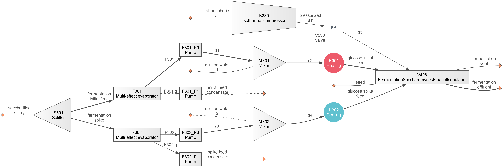
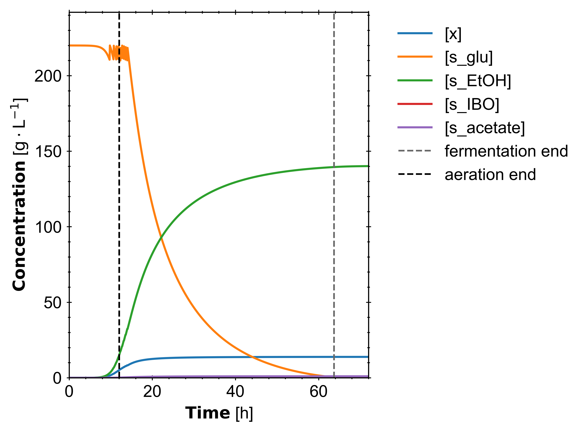
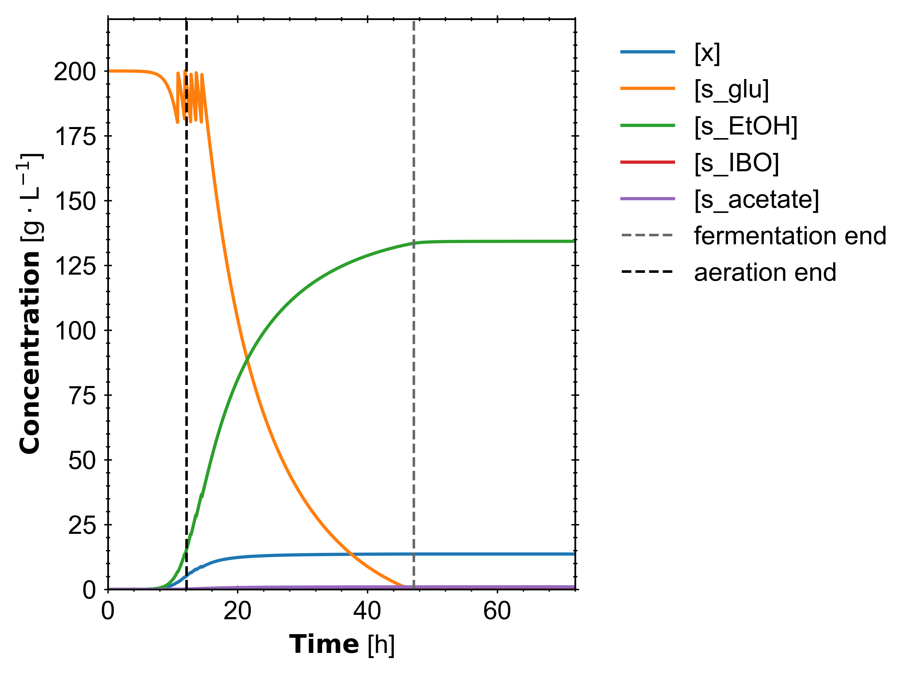

.. image:: docs/source/_static/images/logo/logo_nskinetics_light_white-circle.png
  :width: 250

===============================================================
The (Non-)Steady state Kinetics simulation package (NSKinetics)
===============================================================

.. image:: http://img.shields.io/pypi/v/nskinetics.svg?style=flat
   :target: https://pypi.python.org/pypi/nskinetics
   :alt: Version_status
.. image:: http://img.shields.io/badge/docs-latest-brightgreen.svg?style=flat
   :target: https://nskinetics.readthedocs.io/en/latest/
   :alt: Documentation
.. image:: http://img.shields.io/badge/license-MIT-blue.svg?style=flat
   :target: https://github.com/sarangbhagwat/nskinetics/blob/main/LICENSE
   :alt: license
.. image:: https://img.shields.io/pypi/pyversions/nskinetics.svg
   :target: https://pypi.python.org/pypi/nskinetics
   :alt: Supported_versions
.. image:: https://coveralls.io/repos/github/sarangbhagwat/nskinetics/badge.svg?cachebuster=202507072
   :target: https://coveralls.io/github/sarangbhagwat/nskinetics?branch=main

**Contents**

.. contents::
   :local:

What is NSKinetics?
-------------------

NSKinetics is a fast, flexible, and convenient package in Python for simulating steady- and non-steady-state reaction kinetics — including microbial fermentation and enzyme kinetics — and connecting them to techno-economic analysis (TEA) and life-cycle assessment (LCA) under uncertainty. Kinetic models are declared as SBML — most easily authored as `Antimony <https://tellurium.readthedocs.io/en/latest/antimony.html>`__ text, or imported from an existing SBML file — and wrapped in a ``KineticModel``, which adds unit-aware value access and a Python event API on top of a Tellurium RoadRunner engine that performs the actual ODE integration. ``Event`` covers a single trigger/assignment pair (a parameter switch, a control action); the higher-level ``FeedSpike`` builds on it for fed-batch feeding, topping a species back up to a target concentration whenever it drops below a threshold. The same kinetic model can then drive a `BioSTEAM <https://biosteam.readthedocs.io/en/latest/>`__ process unit through the ``NSKBatchReactor`` bridge, coupling kinetics directly to TEA.

Installation
------------

Get the latest version of NSKinetics from `PyPI <https://pypi.org/project/nskinetics/>`__. If you have an installation of Python with pip, simply install it with:

.. code-block:: bash

    $ pip install nskinetics

To get the git version, run:

.. code-block:: bash

    $ git clone git://github.com/sarangbhagwat/nskinetics

For help on common installation issues, please visit the `documentation <https://nskinetics.readthedocs.io/en/latest/>`__.

Documentation
-------------

NSKinetic's `full documentation <https://nskinetics.readthedocs.io/en/latest/>`__ includes a staged tutorial, starting from a minimal model and building up to a full process/TEA-coupled fed-batch fermentation. The quickstart example below runs that full picture end to end.

One factory call builds a complete, industrially configured process around a real kinetic model: ``nskinetics.processes.create_sugar_prep_and_fermentation_system`` assembles the sugar-solution preparation and fed-batch fermentation section of an actual biorefinery model — a splitter feeding parallel initial-feed and spike-feed conditioning trains (multi-effect evaporator, pumps, dilution-water mixer, heat exchanger), a ``FermentationSaccharomycesEthanolIsobutanol`` fermentor driven by the shipped *S. cerevisiae* kinetic model, and a compressed-air aeration loop. This example runs it end to end: build, simulate, change the fed-batch strategy, and inspect the reactor. Total simulation time is a few seconds once the imports are loaded; every number and figure below is the output of the code shown.

**Step 1: Build the process**

The factory needs only a chemical set — ``set_thermo=True`` activates its
own, shipped set. One call builds the whole section on biosteam's main
flowsheet, with its two inlets (the saccharified sugar slurry and the seed
culture) created with default compositions matching the isobutanol
biorefinery's baseline simulation, ready to use as-is or overwrite:

.. code-block:: python

   import biosteam as bst
   import nskinetics as nsk

   sugar_ferm_sys = nsk.processes.create_sugar_prep_and_fermentation_system(
       set_thermo=True)
   f = bst.main_flowsheet
   sugar_ferm_sys.diagram()

   The factory's flowsheet: ``S301`` splits the slurry between the
   initial-feed train (``F301`` → ``M301`` → ``H301``) and the spike-feed
   train (``F302`` → ``M302`` → ``H302``), both feeding the ``V406``
   fermentor; ``K330``/``V330`` supply compressed air for aeration.

**Step 2: Simulate**

One call runs everything. The factory builds a fed-batch strategy — a
``FedBatchStrategySpecification`` wired to its own units, attached to the
fermentor as ``V406.fbs_spec`` — and ``sugar_ferm_sys.simulate()`` begins by
imposing it: the initial feed is conditioned to the spec's ``target_conc``
(220 g/L glucose), a fed-batch spike fires whenever the reactor's glucose
falls to ``threshold_conc`` (210 g/L), each spike draws from a concentrated
``spike_conc`` (600 g/L) feed, and the evaporators, dilution water, and
splitter are solved so the physical streams actually deliver those
concentrations. Then the flowsheet runs: ``V406`` hands its mixed feed to
the kinetic model, integrates the fed-batch fermentation over the full
``tau_max`` = 72 h window — spikes, aeration switching, and a spike-count
retry included — picks the harvest time ``tau`` where ethanol peaks,
converts that one time point into its effluent stream, and finishes by
re-simulating the aeration loop at the freshly computed air demand. Plotting
the reactor's kinetic trajectory shows the fermentation behind the process
result (the ``simulate()`` call emits a handful of biosteam
``CostWarning``/``DesignWarning`` messages — transient solver states outside
cost-correlation validity ranges — that are benign here):

.. code-block:: python

   sugar_ferm_sys.simulate()
   f.V406.plot_simulation_results()

   The full kinetic trajectory. Early on, 9 spikes hold glucose
   (``[s_glu]``) in the 210–220 g/L band while aerobic growth builds cells
   (``[x]``); aeration ends at ~12 h, when the cell density passes its
   stage-1 cutoff. Glucose is then drawn down to ~0 as ethanol
   (``[s_EtOH]``) climbs to ~139.5 g/L, and the dashed ``fermentation end``
   line marks the selected harvest time ``tau`` ≈ 63.7 h.

**Step 3: Change the fed-batch strategy**

The strategy imposed above is held by the specification the factory attached
to the fermentor, ``f.V406.fbs_spec`` (alias
``fed_batch_strategy_specification``). Calling its ``load_specifications()``
with new values re-imposes the strategy immediately — writing the
concentrations into the kinetic model and re-solving the evaporators,
dilution water, and splitter so the physical streams deliver them — and the
values persist on the spec, so every later ``simulate()`` keeps the new
strategy. Dropping the initial-feed target to 200 g/L and letting glucose
fall to 180 g/L between spikes:

.. code-block:: python

   f.V406.fbs_spec.load_specifications(target_conc=200, threshold_conc=180,
                                       spike_conc=600)
   sugar_ferm_sys.simulate()
   f.V406.plot_simulation_results()

   The same fermentation under the retuned strategy. The batch now starts at
   200 g/L glucose (the re-solved initial-feed evaporator delivers
   ~200.1 g/L), and the wider 180–200 g/L band means fewer, larger spikes —
   5 instead of 9 — so less total glucose is fed: it is exhausted by ~45 h,
   ethanol peaks earlier and slightly lower (~133.5 g/L), and the selected
   harvest time drops to ``tau`` ≈ 47.1 h.

**Step 4: Inspect the reactor**

The same simulation drives a real process unit. ``show()`` lists the
fermentor's inlet and outlet streams — the effluent carries the kinetic
result at the harvest time, mapped onto biosteam chemicals — and
``results()`` is biosteam's standard design-and-cost table, sized and costed
from the kinetic ``tau``. Both reflect the retuned strategy simulated above:

.. code-block:: python

   f.V406.show(N=100)
   print(f.V406.results())

.. code-block:: text

   FermentationSaccharomycesEthanolIsobutanol: V406
   ins...
   [0] glucose_initial_feed  from  HXutility-H301
       phase: 'l', T: 305.15 K, P: 101325 Pa
       flow (kmol/hr): Water    5.83e+03
                       Glucose  117
                       NH3      6.71
   [1] seed
       phase: 'l', T: 298.15 K, P: 101325 Pa
       flow (kmol/hr): Water  0.633
                       Yeast  0.0243
   [2] glucose_spike_feed  from  HXutility-H302
       phase: 'l', T: 305.15 K, P: 101325 Pa
       flow (kmol/hr): Water    1.61e+03
                       Glucose  97.2
                       NH3      5.56
   [3] s5  from  IsenthalpicValve-V330
       phase: 'g', T: 305.15 K, P: 101325 Pa
       flow (kmol/hr): O2  11.3
                       N2  42.4
   outs...
   [0] fermentation_vent
       phase: 'g', T: 305.15 K, P: 101325 Pa
       flow (kmol/hr): Water       17.7
                       AceticAcid  0.0093
                       CO2         419
                       O2          5.64
                       N2          42.4
   [1] fermentation_effluent
       phase: 'l', T: 305.15 K, P: 101325 Pa
       flow (kmol/hr): Water       7.43e+03
                       Ethanol     391
                       AceticAcid  2.16
                       Glucose     6.33e-17
                       Yeast       81.4
   FermentationSaccharomycesEthanolIsobutanol         Units      V406
   Electricity         Power                             kW       473
                       Cost                          USD/hr        37
   Chilled water       Duty                           kJ/hr -5.26e+07
                       Flow                         kmol/hr  3.52e+04
                       Cost                          USD/hr       263
   Design              Reactor volume                    m3  8.85e+03
                       Batch time                        hr       100
                       Loading time                      hr      50.1
                       Number of reactors                           2
                       Recirculation flow rate        m3/hr      79.4
                       Reactor duty                   kJ/hr -1.75e+07
                       Cleaning and unloading time       hr         3
                       Working volume fraction                    0.9
   Purchase cost       Heat exchangers (x2)             USD  4.59e+04
                       Reactors (x2)                    USD  2.81e+06
                       Agitators (x2)                   USD  1.75e+05
                       Cleaning in place                USD  7.62e+05
                       Recirculation pumps (x2)         USD  1.05e+05
   Total purchase cost                                  USD  3.89e+06
   Utility cost                                      USD/hr       300

See the `full tutorial <https://nskinetics.readthedocs.io/en/latest/tutorial/index.html>`__ for the rest of the workflow — writing and simulating a kinetic model from scratch, the ``Event``/``FeedSpike`` API used inside the fermentor here, a tour of the shipped *S. cerevisiae* kinetic model, and the kinetics-to-biosteam bridge behind ``V406``.

Bug reports
-----------

To report bugs, please use NSKinetics's Bug Tracker at:

    https://github.com/sarangbhagwat/nskinetics

Contributing
------------
For guidelines on how to contribute, visit:

    [link to be added]

License information
-------------------

See ``LICENSE.txt`` for information on the terms & conditions for usage
of this software, and a DISCLAIMER OF ALL WARRANTIES.

Although not required by the NSKinetics license, if it is convenient for you,
please cite NSKinetics if used in your work. Please also consider contributing
any changes you make back, and benefit the community.

About the authors
-----------------

NSKinetics was created and developed by `Sarang S. Bhagwat <https://github.com/sarangbhagwat>`__ as part of the `Scown Group <https://cscown.com/>`__ and the `Energy & Biosciences Institute <https://energybiosciencesinstitute.org/>`__ at the `University of California, Berkeley (UC Berkeley) <https://www.berkeley.edu/>`__. 

References
----------
.. [1] ` To be added <link to be added>`__.

