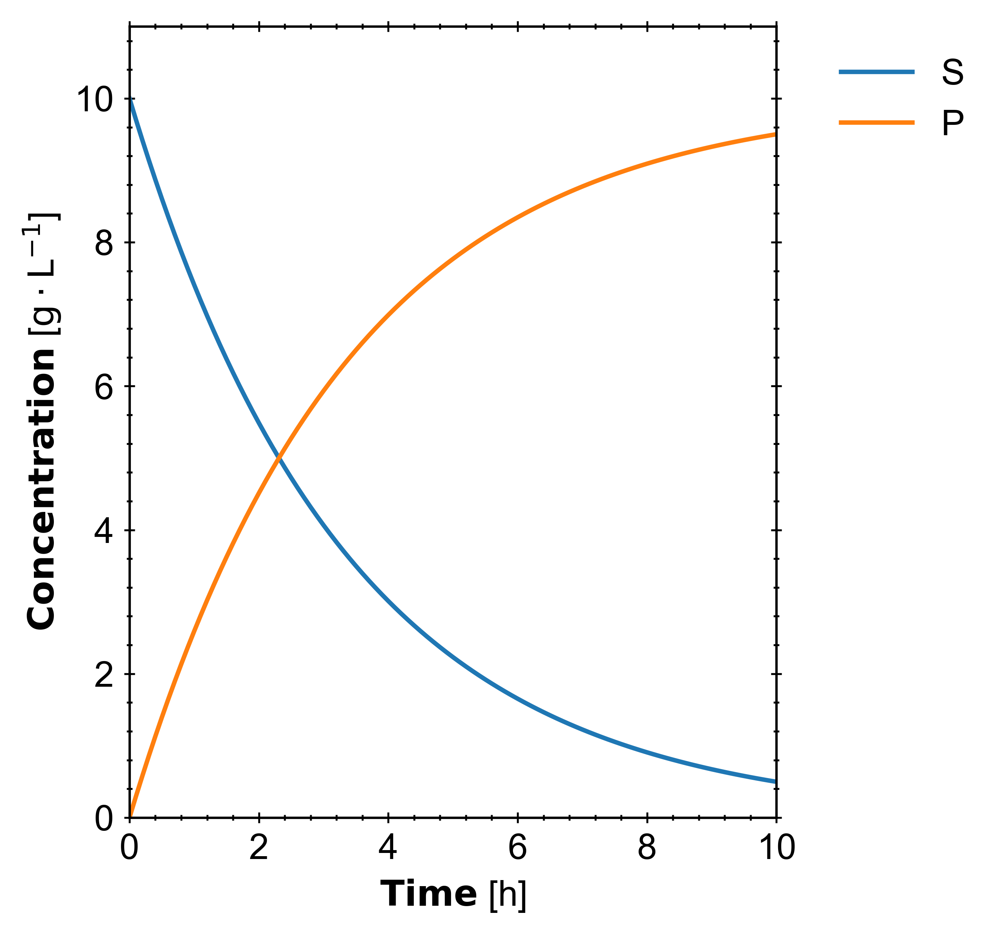
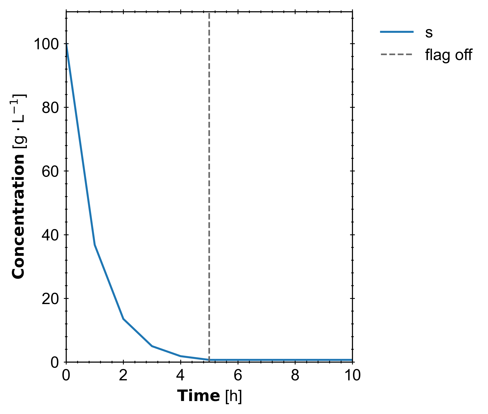
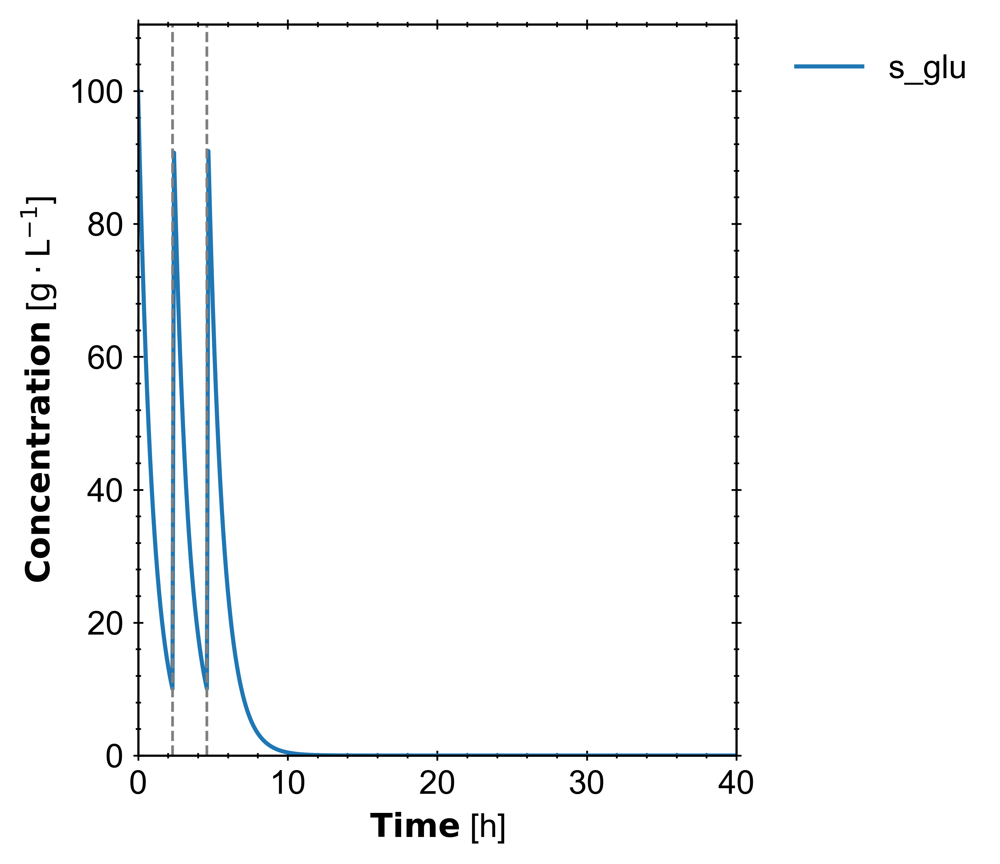

===============================================================
The (Non-)Steady state Kinetics simulation package (NSKinetics)
===============================================================

.. image:: http://img.shields.io/pypi/v/nskinetics.svg?style=flat
   :target: https://pypi.python.org/pypi/nskinetics
   :alt: Version_status
.. image:: http://img.shields.io/badge/docs-latest-brightgreen.svg?style=flat
   :target: https://nskinetics.readthedocs.io/en/latest/
   :alt: Documentation
.. image:: http://img.shields.io/badge/license-MIT-blue.svg?style=flat
   :target: https://github.com/sarangbhagwat/nskinetics/blob/main/LICENSE
   :alt: license
.. image:: https://img.shields.io/pypi/pyversions/nskinetics.svg
   :target: https://pypi.python.org/pypi/nskinetics
   :alt: Supported_versions
.. image:: https://coveralls.io/repos/github/sarangbhagwat/nskinetics/badge.svg?cachebuster=202507072
   :target: https://coveralls.io/github/sarangbhagwat/nskinetics?branch=main

**Contents**

.. contents::
   :local:

What is NSKinetics?
-------------------

NSKinetics is a fast, flexible, and convenient package in Python for simulating steady- and non-steady-state reaction kinetics — especially enzyme kinetics and inhibitory phenomena — and connecting them to techno-economic analysis (TEA) and life-cycle assessment (LCA) under uncertainty. Kinetic models are declared as SBML — most easily authored as `Antimony <https://tellurium.readthedocs.io/en/latest/antimony.html>`__ text, or imported from an existing SBML file — and wrapped in a ``TelluriumReactionSystem``, which adds unit-aware value access and a Python event API on top of a Tellurium RoadRunner engine that performs the actual ODE integration. ``Event`` covers a single trigger/assignment pair (a parameter switch, a control action); the higher-level ``FeedSpike`` builds on it for fed-batch feeding, topping a species back up to a target concentration whenever it drops below a threshold. The same reaction system can then drive a `BioSTEAM <https://biosteam.readthedocs.io/en/latest/>`__ process unit through the ``NSKFermentation`` bridge, coupling kinetics directly to TEA.

Installation
------------

Get the latest version of NSKinetics from `PyPI <https://pypi.org/project/nskinetics/>`__. If you have an installation of Python with pip, simply install it with:

.. code-block:: bash

    $ pip install nskinetics

To get the git version, run:

.. code-block:: bash

    $ git clone git://github.com/sarangbhagwat/nskinetics

For help on common installation issues, please visit the `documentation <https://nskinetics.readthedocs.io/en/latest/>`__.

Documentation
-------------

NSKinetic's `full documentation <https://nskinetics.readthedocs.io/en/latest/>`__ includes a staged tutorial, starting from a minimal model and building up to a full process/TEA-coupled fed-batch fermentation. Here are three stages to get started:

**Example 1: Build and simulate a minimal model**

Kinetic models are declared as SBML; the easiest way to author one by hand is Antimony, a compact text syntax that Tellurium compiles to SBML. Here, species ``S`` decays into ``P`` inside a compartment ``env``, with mass-action rate constant ``k``. Wrapping the resulting RoadRunner object in a ``TelluriumReactionSystem`` adds unit-aware value access; simulation itself always runs through the underlying RoadRunner object:

.. code-block:: python

    import numpy as np
    import tellurium as te
    import nskinetics as nsk

    model = """
    model demo()
      compartment env; species S in env, P in env;
      S = 10; P = 0; env = 1; k = 0.3;
      J: S => P; k*S*env;
    end
    """
    r = te.loadAntimonyModel(model)
    trs = nsk.TelluriumReactionSystem(r, units={'time': 'h', 'conc': 'g/L'})
    trs.validate_units()
    trs.reset()

    result = trs.simulate(0, 10, 101, ['time', '[S]', '[P]'])
    print('t=10:', result[-1])

    fig, ax = trs.plot_simulation_results(labels=['S', 'P'])

``trs.simulate`` integrates the model and stores the trajectory on the
reaction system (``trs.results``); ``plot_simulation_results`` draws the
most recent run. This prints, in the ``HP_2024`` environment:

.. code-block:: text

    t=10: [10.     0.498  9.502]

and produces:

   ``S`` decays from 10 g/L to ~0.498 g/L by ``t=10`` h as ``P`` rises to
   ~9.502 g/L — the 1:1 conversion under first-order decay (``k=0.3``).

**Example 2: Add an event**

Real kinetic models often need to change mid-run — a parameter switches at a fixed time, a control action fires when a species crosses a threshold. ``Event`` mirrors a native SBML event: a trigger expression (``when``) paired with one or more variable assignments (``do``) that fire once the trigger becomes true. Here, species ``s`` decays at rate ``k`` while a ``flag`` parameter is nonzero, and an event flips ``flag`` off at ``time >= 5``:

.. code-block:: python

    import numpy as np, tellurium as te, nskinetics as nsk

    model = """
    model decay()
      species s; s = 100; k = 1; flag = 1;
      s' = -k*flag*s;
    end
    """
    r = te.loadAntimonyModel(model)
    trs = nsk.TelluriumReactionSystem(r, units={'time': 'h', 'conc': 'g/L'})
    trs.add_event(nsk.Event(when='time >= 5', do={'flag': '0'}, name='stop_decay'))
    trs.compile_events()   # regenerates the model; set ICs AFTER this
    trs.reset()

    res = trs.simulate(0, 10, 11, ['time', '[s]', 'flag'])
    print(res)

    trs.plot_simulation_results(labels=['s'], flag_off=5)

This prints, in the ``HP_2024`` environment:

.. code-block:: text

    [[  0.    100.      1.   ]
     [  1.     36.788   1.   ]
     [  2.     13.534   1.   ]
     [  3.      4.979   1.   ]
     [  4.      1.832   1.   ]
     [  5.      0.674   0.   ]
     [  6.      0.674   0.   ]
     [  7.      0.674   0.   ]
     [  8.      0.674   0.   ]
     [  9.      0.674   0.   ]
     [ 10.      0.674   0.   ]]

``flag`` is ``1`` for every row before ``t=5`` and ``0`` from ``t=5`` onward, exactly matching the event's trigger; ``s`` decays exponentially while ``flag=1`` drives the rate law, then freezes at ``0.674`` for the rest of the run once the event zeroes ``flag``. ``trs.results`` holds this same trajectory as an array.

   ``s`` decays while ``flag=1``; the ``stop_decay`` event zeroes ``flag`` at
   ``t=5`` h (dashed line), freezing ``s`` at ~0.674 g/L thereafter.

**Example 3: Fed-batch feeding with FeedSpike**

``FeedSpike`` is a higher-level convenience built on ``Event``: it watches one species and, whenever it drops to a trigger condition, adds enough feed (at a known feed concentration) to bring it back up to a target concentration — while growing the working volume by the amount of feed added. Here, ``s_glu`` starts at 100 g/L and decays at ``k=1``; it would cross the ``threshold`` of 10 g/L repeatedly over 40 h, but ``max_count=2`` (``n_max``) caps it at two spikes:

.. code-block:: python

    import numpy as np, tellurium as te, nskinetics as nsk

    model = """
    model spiker()
      compartment env; species s_glu in env;
      s_glu = 100; env = 1; k = 1;
      threshold = 10; target = 100; feed_conc = 600;
      n_spk = 0; n_max = 2; last_vol = 0; tot_vol = 0; dly = 0;
      n_spk has dimensionless; n_max has dimensionless;
      s_glu' = -k*s_glu;
    end
    """
    r = te.loadAntimonyModel(model)
    trs = nsk.TelluriumReactionSystem(r, units={'time': 'h', 'conc': 'g/L'})
    fs = nsk.FeedSpike(species='s_glu', when='s_glu <= threshold',
                       target='target', feed_conc='feed_conc', volume_var='env',
                       max_count='n_max', count_var='n_spk',
                       last_vol_var='last_vol', tot_vol_var='tot_vol',
                       delay='dly', priority=5, name='spk')
    for e in fs.expand():
        trs.add_event(e)
    trs.compile_events()
    trs.reset()
    res = trs.simulate(0, 40, 401, ['time', '[s_glu]', 'n_spk'])
    print('max spikes:', res[:, 2].max(), 'final s_glu:', res[-1, 1])

    trs.plot_simulation_results(labels=['s_glu'],
                                markers=[(2.3, 'spike'), (4.6, 'spike')])

This prints, in the ``HP_2024`` environment:

.. code-block:: text

    max spikes: 2.0 final s_glu: -6.19487843009339e-12

``max spikes: 2.0`` confirms the cap was reached — exactly two spikes fired. After the second spike, no further trigger fires, so ``s_glu`` decays freely for the rest of the 40 h window, reaching essentially zero (``-6.19e-12`` g/L is floating-point noise).

   Two feed spikes (dashed lines) snap ``s_glu`` back toward 100 g/L; after
   the ``n_max=2`` cap it decays freely to ~0.

See the `full tutorial <https://nskinetics.readthedocs.io/en/latest/tutorial/index.html>`__ for the rest of the workflow, including loading real, shipped SBML models and coupling a reaction system to a BioSTEAM process unit for TEA.

Bug reports
-----------

To report bugs, please use NSKinetics's Bug Tracker at:

    https://github.com/sarangbhagwat/nskinetics

Contributing
------------
For guidelines on how to contribute, visit:

    [link to be added]

License information
-------------------

See ``LICENSE.txt`` for information on the terms & conditions for usage
of this software, and a DISCLAIMER OF ALL WARRANTIES.

Although not required by the NSKinetics license, if it is convenient for you,
please cite NSKinetics if used in your work. Please also consider contributing
any changes you make back, and benefit the community.

About the authors
-----------------

NSKinetics was created and developed by `Sarang S. Bhagwat <https://github.com/sarangbhagwat>`__ as part of the `Scown Group <https://cscown.com/>`__ and the `Energy & Biosciences Institute <https://energybiosciencesinstitute.org/>`__ at the `University of California, Berkeley (UC Berkeley) <https://www.berkeley.edu/>`__. 

References
----------
.. [1] ` To be added <link to be added>`__.

