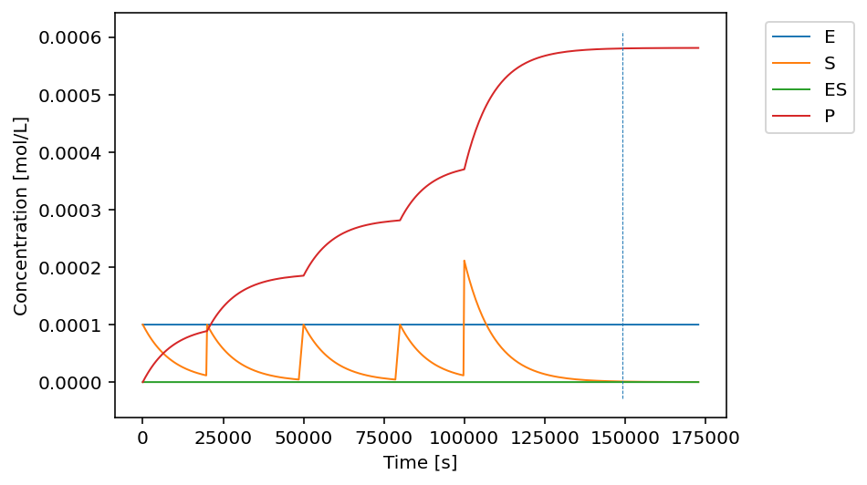

====================================================================================
NSKinetics: simulation of Non-Steady state enzyme Kinetics and inhibitory phenomena.
====================================================================================

.. image:: http://img.shields.io/badge/license-MIT-blue.svg?style=flat
   :target: https://github.com/sarangbhagwat/nskinetics/blob/main/LICENSE
   :alt: license

.. contents::

What is NSKinetics?
-------------------

NSKinetics is a fast, flexible, and convenient package to simulate non-steady state reaction kinetics, especially for systems involving enzymatic conversions. Models for multiple inhibitory phenomena (competitive, non-competitive, uncompetitive, and "mechanism-based") are also included.

Installation
------------

Get the latest version of NSKinetics from `PyPI <https://pypi.org/project/nskinetics/>`__. If you have an installation of Python with pip, simply install it with:

    $ pip install nskinetics

To get the git version, run:

    $ git clone git://github.com/sarangbhagwat/nskinetics

For help on common installation issues, please visit the `documentation <link to be added>`__.

Documentation
-------------

NSKinetic's `full documentation <https://nskinetics.readthedocs.io/en/latest/>`__ is currently being developed. In the meantime, here are some examples to get started:

**Example 1: Simple enzyme-substrate system**

.. code-block:: python

    import nskinetics as nsk

    # Create a SpeciesSystem object
    sp_sys = nsk.SpeciesSystem('sp_sys', 
                           ['E', 'S', 'ES', 'P'], # enzyme, substrate, enzyme-substrate complex, product
                           concentrations=[1e-4, 1e-4, 0, 0])

    # Describe reactions by writing chemical equations and kinetic parameter info
    reactions = [
                'E + S <-> ES; kf = 12, kb = 10.0', # kf = kon, kb = koff
                'ES -> E + P; kf = 32.0' # kf = kcat (enzyme turnover number)
                ]

    # Generate a ReactionSystem from strings
    rxn_sys = nsk.ReactionSystem(ID='ESP_rxn_sys', 
                                 reactions=reactions,
                                 species_system=sp_sys)

    # Simulate the ReactionSystem
    rxn_sys.solve(t_span=[0, 2*24*3600], # I want to simulate the system over 2 days
                 sp_conc_for_events={'S':1e-6}, # In addition to a full simulation,
                 )                              # I want to know the time at which [S] drops to 1e-6

    # Plot results
    rxn_sys.plot_solution() 

Since [ES] was too small to view in the overall plot, let's also plot it separately:

.. code-block:: python

    rxn_sys.plot_solution(sps_to_include=['ES'])

**Example 2: Simple enzyme-substrate system + competitive inhibition + "mechanism-based" inhibition**

.. code-block:: python

    import nskinetics as nsk
    
    # Create a SpeciesSystem object
    sp_sys = nsk.SpeciesSystem('sp_sys', 
                           ['E', 'S', 'ES', 'P',
                            'I_CI', 'EI_CI', 'Q',
                            'I_MBI', 'EI_MBI_unstable', 'EI_MBI_stable'], # mechanism-based_inhibitor, unstable enzyme-MBI complex, stable enzyme-MBI complex 
                           concentrations=[1e-4, 1e-4, 0, 0,
                                           5e-5, 0, 0,
                                           3e-5, 0, 0])
    
    # Describe reactions by writing chemical equations and kinetic parameter info
    reactions = [
                'E + S <-> ES; kf = 12, kb = 10.0',
                'ES -> E + P; kf = 32.0',
                'E + I_CI <-> EI_CI; kf=12, kb=10.0',
                'EI_CI -> E + Q; kf=32',
                'E + I_MBI <-> EI_MBI_unstable; kf=12.0, kb=10',
                'EI_MBI_unstable -> EI_MBI_stable; kf = 32'
                ]
    
    # Generate a ReactionSystem from strings
    rxn_sys = nsk.ReactionSystem(ID='rxn_sys', 
                                     reactions=reactions,
                                     species_system=sp_sys)
    
    # Simulate the ReactionSystem
    rxn_sys.solve(t_span=[0, 2*24*3600],
                  sp_conc_for_events={'S':1e-6})
    
    # Plot results
    rxn_sys.plot_solution()

**Example 3: Simple enzyme-substrate system in a fed-batch regime**

.. code-block:: python

    import nskinetics as nsk
    
    # Create a SpeciesSystem object
    sp_sys = nsk.SpeciesSystem('sp_sys', 
                           ['E', 'S', 'ES', 'P',],
                           concentrations=[1e-4, 1e-4, 0, 0,])
    
    # Describe reactions by writing chemical equations and kinetic parameter info
    reactions = [
                'E + S <-> ES; kf = 12, kb = 10.0',
                'ES -> E + P; kf = 32.0',
                ]
    
    # Generate a ReactionSystem from strings
    rxn_sys = nsk.ReactionSystem(ID='rxn_sys', 
                                     reactions=reactions,
                                     species_system=sp_sys)
    
    
    # Describe forced concentration spikes for any species 
    # (e.g., from feeding substrate in a fed-batch regime)
    spikes = {20000: 'Target; S; 1e-4', # at t=40000, add enough S to achieve [S]=1e-4
              50000: 'Target; S; 1e-4', # at t=50000, add enough S to to achieve [S]=1e-4
              80000: 'Target; S; 1e-4', # at t=80000, add enough S to achieve [S]=1e-4
              100000: 'Change; S; 2e-4',# at t=100000, add enough S to increase [S] by 2e-4
              }
    
    # Simulate the ReactionSystem
    rxn_sys.solve(t_span=[0, 2*24*3600],
                  sp_conc_for_events={'S':1e-6},
                  spikes=spikes)
    
    # Plot results
    rxn_sys.plot_solution()

Bug reports
-----------

To report bugs, please use NSKinetics's Bug Tracker at:

    https://github.com/sarangbhagwat/nskinetics

Contributing
------------
For guidelines on how to contribute, visit:

    [link to be added]

License information
-------------------

See ``LICENSE.txt`` for information on the terms & conditions for usage
of this software, and a DISCLAIMER OF ALL WARRANTIES.

Although not required by the NSKinetics license, if it is convenient for you,
please cite NSKinetics if used in your work. Please also consider contributing
any changes you make back, and benefit the community.

About the authors
-----------------

BioSTEAM was created and developed by `Sarang S. Bhagwat <https://github.com/sarangbhagwat>`__ as part of the `Scown Group <https://cscown.com/>`__ and the `Energy & Biosciences Institute <https://energybiosciencesinstitute.org/>`__ at the `University of California, Berkeley (UC Berkeley) <https://www.berkeley.edu/>`__. 

References
----------
.. [1] ` To be added <link to be added>`__.

